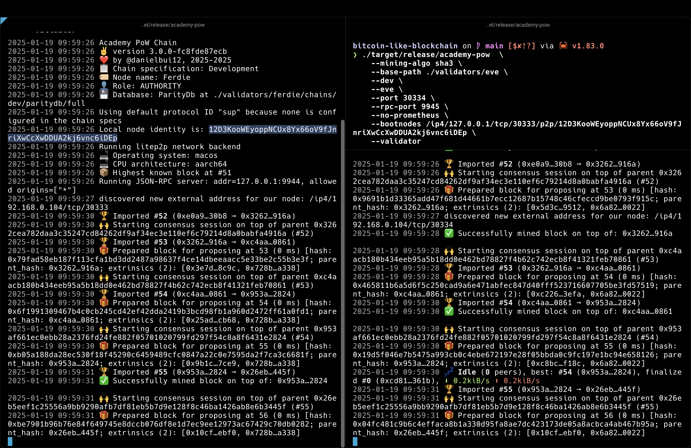
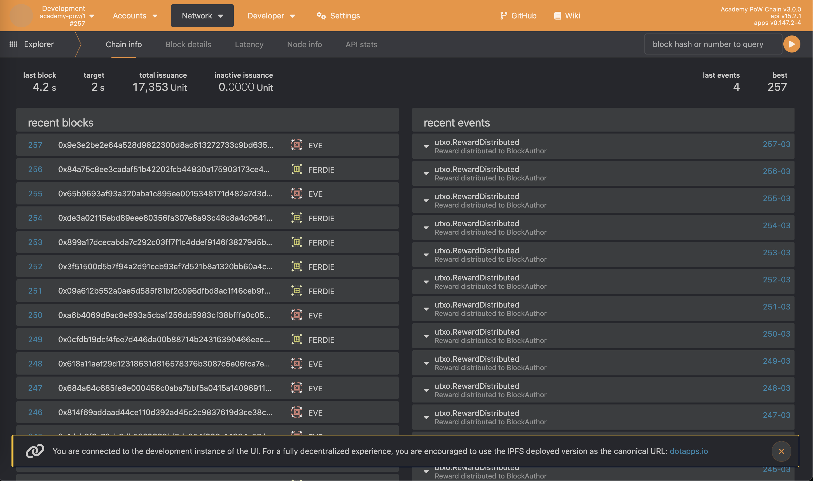

# How to run the node

## Building the Node

First you will need a [Substrate developer environment](https://docs.substrate.io/install/).

1. Cloning this repo
2. Running `cargo build --release`

## Run a Single Development Node

Use native binary to start a local blockchain node:

```sh
./target/release/academy-pow --dev --tmp --mining-algo md5
```

Enable log, or tracing steps:

```sh
RUST_LOG=debug ./target/release/academy-pow --dev --tmp --mining-algo md5
```


## MultiNode

```sh
# Start the first local blockchain node using Ferdie account,
# using md5 algorithm 
./target/release/academy-pow  \
    --mining-algo md5 \
    --base-path ./validators/ferdie \
    --dev \
    --ferdie \
    --port 30333 \
    --rpc-port 9944 \
    --node-key 0000000000000000000000000000000000000000000000000000000000000001 \
    --no-prometheus \
    --validator

# Start the second local blockchain node using Eve account,
# using sha3 algorithm
./target/release/academy-pow  \
    --mining-algo sha3 \
    --base-path ./validators/eve \
    --dev \
    --eve \
    --port 30334 \
    --rpc-port 9945 \
    --no-prometheus \
    --bootnodes /ip4/127.0.0.1/tcp/30333/p2p/12D3KooWEyoppNCUx8Yx66oV9fJnriXwCcXwDDUA2kj6vnc6iDEp \
    --validator
```

Then you can see Ferdie and Eve are continuously producing blocks.




## Purge chain

```sh
./target/release/academy-pow purge-chain --base-path ./validators/ferdie --dev
./target/release/academy-pow purge-chain --base-path ./validators/eve --dev
```

## More Help

```sh
academy-pow --help
```