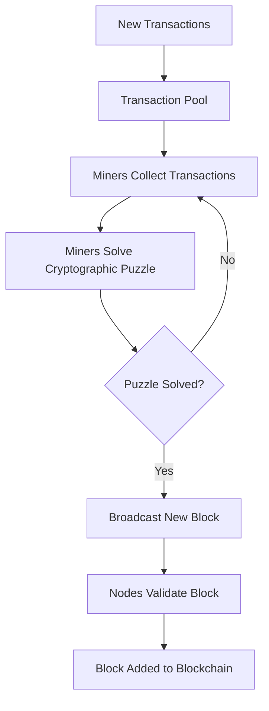
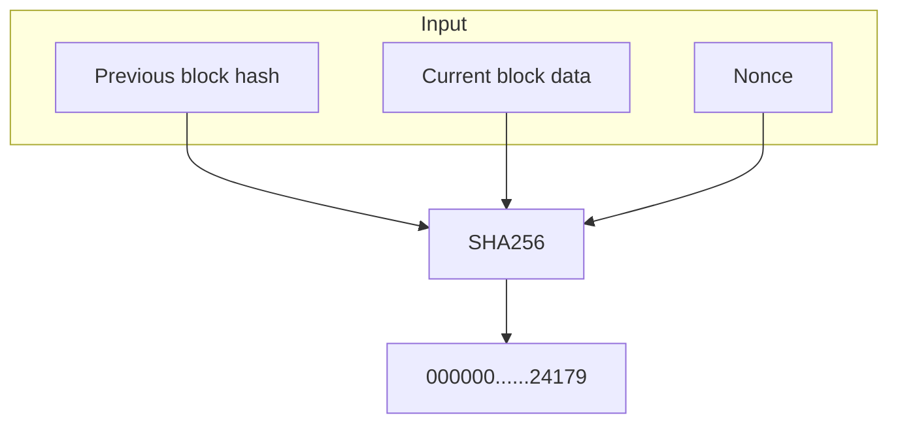

# Understanding Proof-of-Work (PoW)

## What is PoW

Proof-of-Work (PoW) is a consensus mechanism used in blockchain networks to achieve agreement among distributed nodes. It requires participants, often called miners, to perform computational work to validate transactions and add them to the blockchain. PoW was first introduced in Bitcoin and has become a foundational element in the blockchain ecosystem.

### Key Features of PoW

- **Decentralization**: Ensures no central authority controls the network.
- **Security**: Prevents malicious actors from easily taking over the network.
- **Incentives**: Rewards participants with newly minted cryptocurrency and transaction fees.

## Understanding Consensus

Consensus refers to the process by which blockchain participants agree on the validity of transactions and the state of the ledger. In a decentralized network, consensus mechanisms are essential to ensure the integrity of the blockchain without relying on a trusted third party.

### Characteristics of a Consensus Mechanism

- **Fault Tolerance**: The ability to handle malicious or faulty nodes.
- **Scalability**: Supporting a growing number of participants and transactions.
- **Energy Efficiency**: Minimizing resource consumption.

## How PoW Works

In a PoW-based system, miners compete to solve a cryptographic puzzle. The first miner to solve the puzzle gets the right to add a new block to the blockchain and receives a reward. Here is a step-by-step breakdown:

In essence, the process involves:

1. **Transaction Collection**: New transactions are added to a pool awaiting inclusion in the blockchain.
2. **Puzzle Solving**: Miners compete to find a solution to a cryptographic puzzle. This typically involves finding a "nonce" – a random number – that, when combined with the previous block's hash and the current block's data, produces a hash value that meets specific criteria.
3. **Hashing**: Miners use a cryptographic hash function (like SHA-256) to hash the combination of the nonce, previous block hash, and current block data.
4. **Solution** Verification: The first miner to find a solution broadcasts the new block to the network.
5. **Network Validation**: Other nodes on the network verify the block's validity and its inclusion in the blockchain.
6. **Block Addition**: If the block is valid, it is added to the blockchain, and the successful miner receives a reward.

In Bitcoin use case, miners have to compete to guess the `Nonce` number as soon as possible.
With `Previous block hash`, `Current block data` put into SHA256 to get the hash of current block, then submit to the blockchain.
After that, other miners will participate in block validation.

### 51% Attack

A significant vulnerability in PoW systems is the possibility of a **51% attack**. This occurs when a single miner or group of miners gains control of more than 50% of the network's computational power. With such dominance, they could:

- **Double-spend coins**: Reverse transactions they previously made.
- **Block transactions**: Prevent new transactions from being confirmed.
- **Disrupt the network**: Cause general instability and undermine trust.

While a 51% attack is theoretically possible, executing it on large, well-established networks like Bitcoin is extremely difficult due to the immense computational power required.

> [!Note]
> Why it is 51% instead of just greater than 50%?

The distinction is of theoretical importance only. But if the attacker controls exactly 50%, then it's true that the attacker will eventually catch up, but he won't stay caught up: the honest population will eventually overtake his chain, and we'll be in an unstable situation where control of the "best" chain will bounce back and forth between them forever.

If the attacker wants to eventually catch up and stay caught up, he needs to have strictly greater than half of the mining power. In this case, they might bounce back and forth for a while, but eventually there will come a time when the attacker takes the lead and never again loses it. We say "51%" informally to summarize this, though of course 50.1% or 50.000001% would also be sufficient.

See a more detail explanation about this on [Cryptography exchange](https://crypto.stackexchange.com/a/97741).

## Comparing PoW with Proof-of-Stake (PoS)

While PoW relies on computational power, Proof-of-Stake (PoS) selects validators based on their stake in the network. Here’s a comparison:

### Key Differences

| Feature                 | Proof-of-Work (PoW)          | Proof-of-Stake (PoS)            |
| ----------------------- | ---------------------------- | ------------------------------- |
| **Energy Usage**        | High                         | Low                             |
| **Validator Selection** | Computational power          | Cryptocurrency stake            |
| **Security**            | Robust, resistant to attacks | Dependent on stake distribution |
| **Scalability**         | Limited                      | High                            |

## Where to go next?

This is just a brief about Proof-of-Work. If you want to learn more about Proof of Work and Bitcoin, please find and read Mastering Bitcoin book. That explains what Bitcoin is and how it works including Proof-of-Work. (Or [free version of community](https://github.com/bitcoinbook/bitcoinbook))
