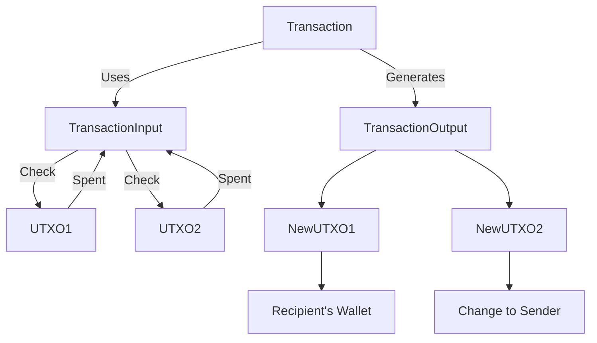
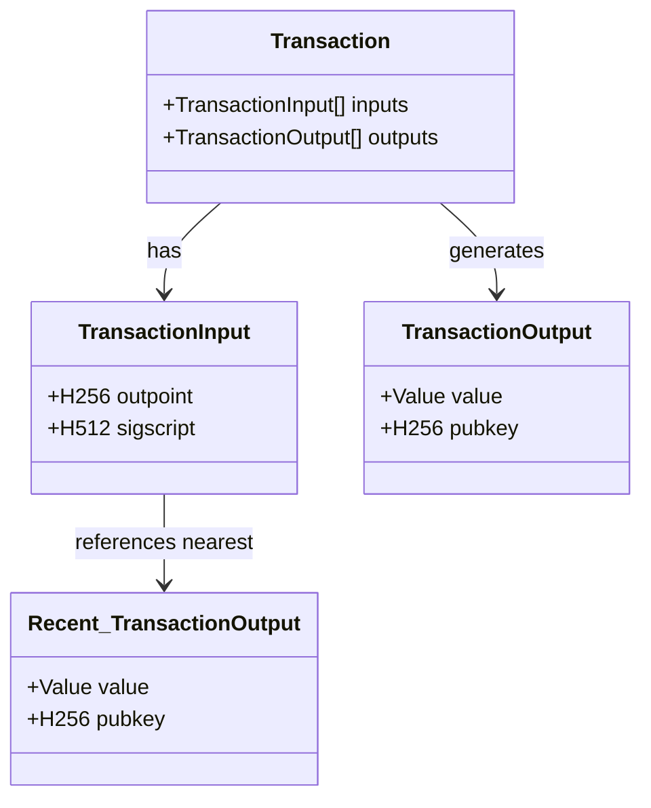

# Unspent Transaction Output (UTXO)

## Definition

The **Unspent Transaction Output (UTXO)** model is a method used in blockchain systems, such as **Bitcoin**, to manage and track ownership of digital assets.
It represents the amount of cryptocurrency that remains after a transaction and is available for future spending.
For example: if you have a **$100** bill and need to pay **$15**, you spend the **$20** bill and receive **$5** as change.

## Concept

Generally, in the UTXO model, a transaction consists of **inputs** and **outputs**. The **TransactionInput** references previous **UTXOs** that are being spent, and the **TransactionOutput** creates new UTXOs for the recipient and the sender’s change. 

The flow can be visualized as follows:

Let's dive deep into each model, the following schema illustrates the relationships between the structs: `Transaction`, `TransactionInput`, and `TransactionOutput`.

**Explanation:**
- `Transaction`: Contains vectors of `TransactionInput` and `TransactionOutput`, representing the inputs and outputs of the transaction.
- `TransactionInput`: 
    - `outpoint`: a unique identifier for a UTXO, point to the recent `TransactionOutput`s of _Sender_. i.e: Alice already has an UTXO $10 (0x1), now she wants to use it to _"spend"_. So the `outpoint` points to the _UTXO $10_.
    - `sigscript`: a script to validate the transaction.
- `TransactionOutput`: 
    - `value`: the amount being transferred.
    - `pubkey`: the public key for the recipient.

## Key Feature

1. **Transaction Process**  
   - Transactions consume one or more UTXOs as inputs and create new UTXOs as outputs.  
   - Inputs are _“spent”_ UTXOs, and outputs are newly created UTXOs, distributed to the recipient and possibly back to the sender as change.  

2. **Validation and Security**  
   - UTXOs are verified by nodes to ensure the inputs are valid, unspent, and signed by the rightful owner.  
   - Double-spending is prevented since each UTXO can only be used once.  

3. **UTXO Set**  
   - The UTXO set is the collection of all unspent outputs currently recorded in the blockchain.  
   - It defines the balance available for spending and is used during transaction validation.  

4. **Advantages**
    - High Security: The UTXO model is highly regarded for its security due to the use of digital signatures and encryption in transactions. Using UTXOs requires a valid private key, making it harder for fraudsters to impersonate or perform fraudulent actions compared to traditional accounting ledger models.
    - Controllable: Users have complete control over their UTXOs and can choose how to spend them. This provides high flexibility in managing cryptocurrency assets.
    - Transparency: All UTXOs are recorded on the blockchain, allowing anyone to check their balances and transaction history. This promotes transparency and security in the cryptocurrency ecosystem.

5. **Disadvantages**
    - **Complexity**: The UTXO model can be harder to understand for users. Managing multiple UTXOs can become cumbersome and requires some technical knowledge.
    - **Transaction Size**: UTXO transactions can be larger than transactions in other models, leading to higher transaction fees. This can impact the efficiency of using cryptocurrency for small payments.
    - **Usability**: Using UTXOs may require more steps compared to other models, making it less convenient for new users.

## Comparing Account based vs. UTXO

| Feature                     | Account-Based Model                                  | UTXO Model                                          |
|-----------------------------|------------------------------------------------------|-----------------------------------------------------|
| **Tracking System**          | Tracks balances of accounts                         | Tracks unspent transaction outputs (UTXOs)          |
| **Transaction Input**        | Directly modifies account balance                   | Consumes UTXOs as inputs and creates new UTXOs       |
| **Transaction Output**       | Outputs go to the account balance                   | Outputs create new UTXOs that can be spent later    |
| **Privacy**                  | Less private, as account balances are directly visible| More privacy, as multiple UTXOs can be used for one transaction |
| **Scalability**              | Easier to scale, as the system handles fewer data structures | More complex as each UTXO must be tracked and verified |
| **Transaction Size**         | Typically smaller, as it only requires updating balances | Larger due to multiple UTXOs and change transactions |
| **Flexibility**              | Less flexible, as it works with account balances    | More flexible, as UTXOs can be mixed and matched    |
| **Security**                 | Security through account balances and signatures    | Security through digital signatures for each UTXO   |
| **Double-Spending**          | Prevented by centralized ledger or smart contract logic | Prevented by ensuring UTXOs are only used once      |
| **Complexity**               | Simpler for users, with easier-to-understand balances | More complex, especially for users managing multiple UTXOs |
