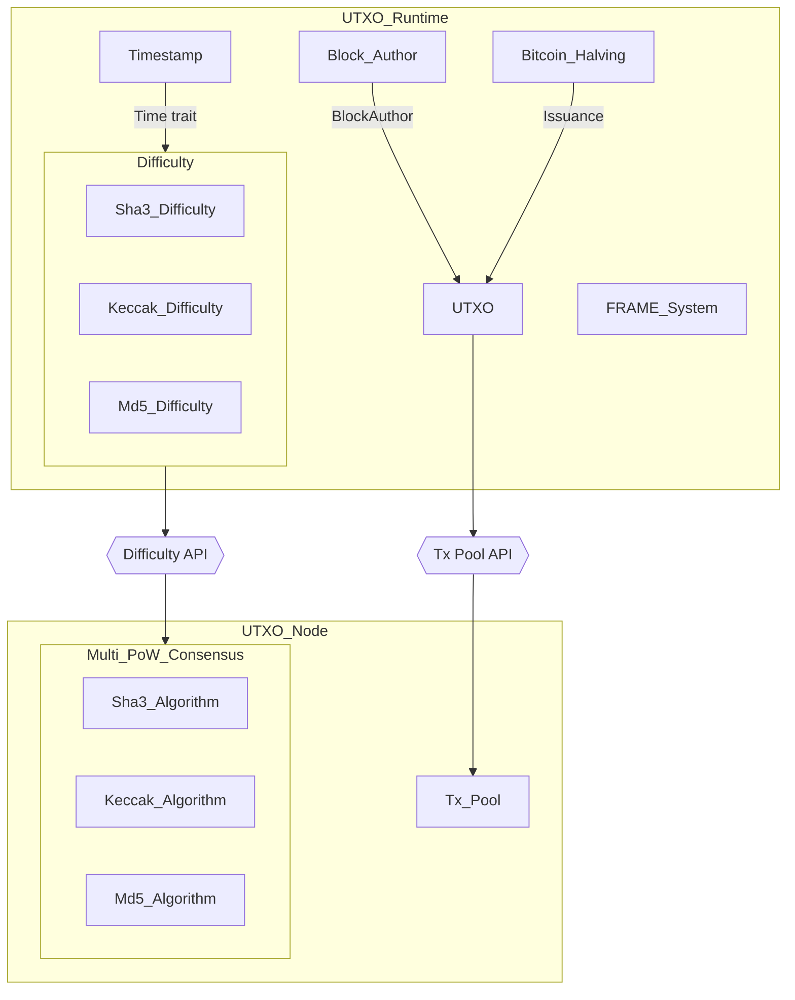

# Substrate Bitcoin-Like Blockchain Introduction

This repository is derived from [Academy-PoW](https://github.com/Polkadot-Blockchain-Academy/Academy-PoW), originally designed as a learning resource. While implementing a Bitcoin-like blockchain, I faced several challenges that required updates and fixes to ensure smooth execution. Additionally, I transitioned the account model from an **Account-based** system to a **UTXO-based** approach. This implementation builds upon the foundational work from **[Building a UTXO Chain from Scratch | Substrate Seminar](https://www.youtube.com/watch?v=XuJmxMMHvDw)**. Inspired by this resource, I aimed to further enhance the project, incorporating my own insights and improvements.  

## Prerequisites  

Before starting this interactive tutorial, you should have a basic understanding of **Substrate** and **FRAME development**. If you're new to these concepts, it's highly recommended to complete the introductory Substrate tutorials available in the official documentation. For example [Substrate Interactive Tutorial - Polkadot Study](https://polkadot.study/tutorials/interactive-substrate-tutorials-rusty-crewmates/).

## Useful Resources

Here are some essential resources that will assist you throughout this tutorial:  

- [Set Up Substrate Development Environment](https://docs.substrate.io/install/) – Choose your environment and complete the installation of required packages and Rust.  
- [Polkadot SDK Documentation](https://paritytech.github.io/polkadot-sdk/master/polkadot_sdk_docs/polkadot_sdk/index.html) – In-depth reference for the Polkadot SDK.  
- [Simulating a Substrate Network](https://docs.substrate.io/tutorials/build-a-blockchain/simulate-network/) – Learn how to simulate a network in Substrate.  
- [Unspent Transaction Output (UTXO)](https://github.com/danielbui12/substrate-bitcoin-like-blockchain/blob/main/docs/utxo/utxo.md) – Understanding UTXO account model.
- [Proof of Work code breakdown](https://github.com/danielbui12/substrate-bitcoin-like-blockchain/blob/main/docs/pow/code-breakdown.md) – Learn how the Proof of Work code is implemented.

By following these resources, you’ll gain a solid foundation in Substrate development, enabling you to make the most of this tutorial. 🚀  

Overview of Bitcoin-like Blockchain in Substrate we will be building:

