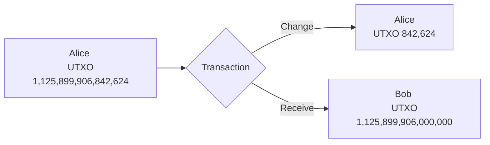

# Wrap up

Wow, you've made it all the way to the end!

Congratulations on completing all steps! 🎉 You've done an amazing job and you're all done! 🙌

Start hacking by following demo usage tutorial!

## Demo usage

> [!IMPORTANT]
> Please follow up strictly these value to have best experience 😉.

### Address

- Powerful tool to convert `SS58 account` to `sr25519::Pubkey`: https://polkadot.subscan.io/tools/format_transform
- Alice: from `5GrwvaEF5zXb26Fz9rcQpDWS57CtERHpNehXCPcNoHGKutQY` to `0xd43593c715fdd31c61141abd04a99fd6822c8558854ccde39a5684e7a56da27d`
- Bob: from `5FHneW46xGXgs5mUiveU4sbTyGBzmstUspZC92UhjJM694ty` to `0x8eaf04151687736326c9fea17e25fc5287613693c912909cb226aa4794f26a48` 

### Scenario

1. Initially, Alice has a UTXO 1,125,899,906,842,624.
2. She transfers to BOB a UTXO 842,624; but she doesn't have a UTXO $842,624. So she has to use her 1,125,899,906,842,624.
3. `TransactionInput` contains `outpoint` is UTXO 1,125,899,906,842,624; `sigscript` is signed data of "simple transaction" (refer to `runtime/src/utxo.rs:354`).
5. There will be 2 `TransactionOutput`s:
    - `TransactionOutput` contains `value` is UTXO 842,624; `pubkey` is Bob address
    - `TransactionOutput` contains `value` is UTXO 1,125,899,906,000,000; `pubkey` is Alice address



### Steps

- Navigate to: https://polkadot.js.org/apps/?rpc=ws%3A%2F%2F127.0.0.1%3A9944#/extrinsics

**Check balance**


- Switch to [_Chain State_](https://polkadot.js.org/apps/?rpc=ws%3A%2F%2F127.0.0.1%3A9944#/chainstate), select `utxo`, `utxoOf`
- Input: `0xd43593c715fdd31c61141abd04a99fd6822c8558854ccde39a5684e7a56da27d`
- Press **+** button
- Verify Alice has a UTXO hash
```
utxo.utxoOf: Option<H256>
0xc670c5f69081da78af400552edcafa3f0f31e84db1b50dd70776e0f87477b3dc
```


- Then select `utxo`, `utxoStore`
- Input: `0xc670c5f69081da78af400552edcafa3f0f31e84db1b50dd70776e0f87477b3dc`
- Press **+** button
- Verify Alice has a UTXO value
```
utxo.utxoStore: Option<AcademyPowRuntimeUtxoTransactionOutput>
{
  value: 1,125,899,906,842,624
  pubkey: 0xd43593c715fdd31c61141abd04a99fd6822c8558854ccde39a5684e7a56da27d
}
```


**Alice transfers UTXO 842,624 to Bob, get back UXTO 1,125,899,906,000,000**


**Input**

- `inputs[0].outpoint`: 0xc670c5f69081da78af400552edcafa3f0f31e84db1b50dd70776e0f87477b3dc
- `inputs[0].sigscript`: 0xa23674686467cf6a3d755987276e1dbb71b4800ff99f2721e7d4fd52774fe43086ed5a385b5cde80a346be5eb7afd3e95ef1dd9b9069deee889cd432891ba481

- `outputs[0].value`: 842624
- `outputs[0].pubkey`: `0x8eaf04151687736326c9fea17e25fc5287613693c912909cb226aa4794f26a48`
- `outputs[1].value`: 1125899906000000
- `outputs[1].pubkey`: `0xd43593c715fdd31c61141abd04a99fd6822c8558854ccde39a5684e7a56da27d`


Then submit unsigned transaction


**Events**

- New UTXO hash of Bob: `0x60bfe689ea5d2f0e2380a146289067465a3608b9ef20ef9e152cf501c0040dba`
- New UTXO hash of Alice: `0x426e4f172479a674b4c044c34a77453bdf4ddbdf8b3993d586a05d9cffe57bd3`


**Check balance**

- Switch to [_Chain State_](https://polkadot.js.org/apps/?rpc=ws%3A%2F%2F127.0.0.1%3A9944#/chainstate), select `utxo`, `utxoStore`

Alice: 
- Input: `0x426e4f172479a674b4c044c34a77453bdf4ddbdf8b3993d586a05d9cffe57bd3`
- Press **+** button
- Verify Alice has a UTXO 1,125,899,906,000,000

Bob:
- Input: `0x60bfe689ea5d2f0e2380a146289067465a3608b9ef20ef9e152cf501c0040dba`
- Press **+** button
- Verify Bob has a UTXO 842,624


### Custom your own

> [!NOTE]
> If you would love to play in your own way, refer to `scripts/generate-signature/index.js` to generate your own custom signed data!

## Run multiple nodes

```sh
# Start the first local blockchain node using Ferdie account,
# using md5 algorithm 
./target/release/academy-pow  \
    --mining-algo md5 \
    --base-path ./validators/ferdie \
    --dev \
    --ferdie \
    --port 30333 \
    --rpc-port 9944 \
    --node-key 0000000000000000000000000000000000000000000000000000000000000001 \
    --no-prometheus \
    --validator

# Start the second local blockchain node using Eve account,
# using sha3 algorithm
./target/release/academy-pow  \
    --mining-algo sha3 \
    --base-path ./validators/eve \
    --dev \
    --eve \
    --port 30334 \
    --rpc-port 9945 \
    --no-prometheus \
    --bootnodes /ip4/127.0.0.1/tcp/30333/p2p/12D3KooWEyoppNCUx8Yx66oV9fJnriXwCcXwDDUA2kj6vnc6iDEp \
    --validator
```

Then you can see Ferdie and Eve are continuously producing blocks.


### Purge chain

```sh
./target/release/academy-pow purge-chain --base-path ./validators/ferdie --dev
./target/release/academy-pow purge-chain --base-path ./validators/eve --dev
```

## More Help

```sh
academy-pow --help
```


