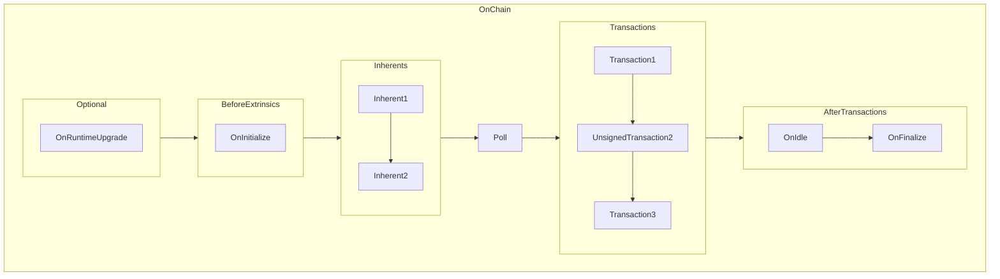

# Disperse Reward

> [!Note]
> Resolve all TODO in `runtime/src/utxo.rs` to complete this step.

### Reading Materials

> The block reward is a combination of the block subsidy and all transaction fees paid by transactions in a specific block. When miners mine a block, they receive a block subsidy in the form of newly minted bitcoin. All transactions also include a fee, which miners collect. The block reward is the sum of these two amounts. As block subsidies are cut in half every four years, fees will slowly become a greater portion of the block reward. The term block reward and block subsidy are occasionally used interchangeably. 
> 
>
> The block reward is paid out in the blockchain transaction of each block. This special transaction is the first transaction in every block, and it has no inputs.

So the problem in this step is that we've to distribute the block reward to the miners who successfully solve the puzzle to mine new blocks.

Before go to this tutorial, please read these documents to understand transaction lifecycle in Substrate:

- [Polkadot Blockchain Academy - Hook lecture](https://polkadot-blockchain-academy.github.io/pba-book/frame/hooks/page.html)

- Recap: Onchain/STF Hooks:



### Implement

To disperse block reward to block author, we'll use `on_finalize` hook. 


To implement the Hooks trait provides logic that is executed at the end of each block. 
- Start with `#[pallet::hooks]` macro. 
- Implements the `Hooks` trait for the pallet. This trait is generic over the `BlockNumberFor<T>`, which represents the type of block number defined in the runtime configuration.
- `fn on_finalize(_n: BlockNumberFor<T>)`: This function is triggered automatically at the end of each block.

```rust
#[pallet::hooks]
impl<T: Config> Hooks<BlockNumberFor<T>> for Pallet<T> {
    fn on_finalize(_n: BlockNumberFor<T>) {
        match T::BlockAuthor::block_author() {
            // Block author did not provide key to claim reward
            None => Self::deposit_event(Event::RewardWasted),
            // Block author did provide key, so issue thir reward
            Some(author) => Self::disperse_reward(&author),
        }
    }
}
```

---

Implement logic of function `disperse_reward`

```rust
/// Redistribute combined reward value to block Author
fn disperse_reward(author: &Public) {
    // take the cumulative reward in storage
    // plus issuance of blocknumber
    let reward = TotalReward::<T>::take()
        + T::Issuance::issuance(frame_system::Pallet::<T>::block_number());

    // create new UTXO
    let utxo = TransactionOutput {
        value: reward,
        pubkey: H256::from_slice(author.as_slice()),
    };

    // hash UTXO to get the key
    let hash = BlakeTwo256::hash_of(&(
        &utxo,
        frame_system::Pallet::<T>::block_number().saturated_into::<u64>(),
    ));

    // mutate storage
    Self::store_utxo(&utxo, hash);
    
    // emit event `RewardDistributed`
    Self::deposit_event(Event::RewardDistributed(reward, hash));
}
```

--- 

Build the code

```sh
cargo build --release
```

--- 

Fantastic job completing a new step! 🌟 You're almost there. Let's move forward to next step.
